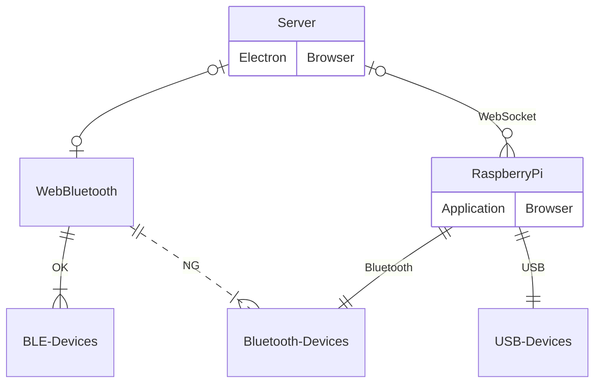

# WebBluetoothと代案

色々テストしてみたが、現在のWebBluetoothはBLEデバイスしか接続でないようです。
https://developer.mozilla.org/en-US/docs/Web/API/Web_Bluetooth_API にも`The Web Bluetooth API provides the ability to connect and interact with Bluetooth Low Energy peripherals.`と記載がありました。__Bluetooth Low Energy == BLE__

下のERグラフは、マウスやトラックボールもしくはVRリモコンなど、任意のコントロールデバイスを扱う場合の１案です。
１デバイス：１ラズバイで接続し、ラズバイからWebSocketで通信します。
* メリット
  - 多様なデバイスをサポートできる
  - WebSocketでI/F統一できる
  - プログラムが容易
* デメリット
  - ラズバイの導入コスト
  - 若干のタイムラグが予想される

#### BLEデバイス接続（ハイレベル）

話が戻ってしまいますが、BLEデバイスを用意することが出来るなら、WebBluetoothでもいいかもしれません。実際に、[ESP32 DevKitC](https://www.espressif.com/en/products/devkits/esp32-devkitc/overview) を使用してBLEデバイスをプログラムしてテストを行いました。仕様通り接続＆通信の確認が出来ました。
BLEデバイス自作するメリットとして、通常のBluetoothデバイスは30秒程度でスリープモードに入ってしまい、使いたいときに使えない（再接続が必要）ですが、自作ならそういった問題はありません。デメリットは開発コストが高いことです。

以上
